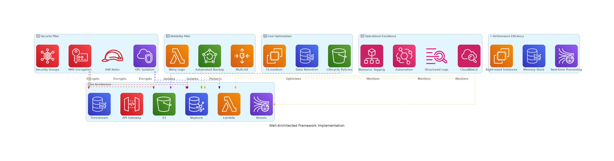

# Timestream & Neptune Analytics Platform

## アーキテクチャ概要

このプロジェクトは、Amazon TimestreamとAmazon Neptuneを組み合わせた、Well-Architected Framework準拠の分析プラットフォームです。時系列データとグラフデータを統合して、包括的な分析機能を提供します。

## 📊 アーキテクチャ図

### 1. 全体アーキテクチャ図


**主要コンポーネント:**
- **VPC 3層アーキテクチャ**: Public/Private/Database サブネットによる適切な分離
- **リアルタイム処理**: Kinesis Data Streams → Lambda → Timestream/Neptune
- **セキュリティ**: KMS暗号化、IAM最小権限、セキュリティグループ
- **監視**: CloudWatch、EventBridge による包括的な監視

### 2. データフロー詳細図


**データフローの詳細:**
- **取り込み層**: IoTセンサー、アプリケーション、外部APIからのデータ
- **ストリーミング層**: Kinesis Data Streams（2シャード、KMS暗号化）
- **処理層**: Lambda関数による並列データ処理
- **ストレージ層**: Timestream（時系列）、Neptune（グラフ）、S3（アーカイブ）
- **API層**: API Gateway経由でのクエリアクセス

### 3. Well-Architected Framework実装図


**5つの柱の実装:**
- **🔒 セキュリティ**: KMS暗号化、IAMロール、VPC分離
- **🛡️ 信頼性**: マルチAZ、自動バックアップ、リトライ機能
- **⚡ パフォーマンス効率性**: リアルタイム処理、階層ストレージ
- **💰 コスト最適化**: ライフサイクルポリシー、適切なサイジング
- **🔧 運用上の優秀性**: 監視、ログ記録、自動化

## Well-Architected Framework 準拠

### 1. セキュリティ (Security)
- **暗号化**: KMS キーによる保存時・転送時暗号化
- **ネットワークセキュリティ**: VPC、セキュリティグループによる適切な分離
- **IAM**: 最小権限の原則に基づくロール設計
- **監査**: VPC Flow Logs、Neptune監査ログの有効化
- **CDK Nag**: セキュリティベストプラクティスの自動チェック

### 2. 信頼性 (Reliability)
- **高可用性**: マルチAZ構成
- **バックアップ**: Neptune 7日間バックアップ保持
- **障害対応**: Lambda関数のリトライ機能
- **データ保護**: S3バージョニング有効化

### 3. パフォーマンス効率性 (Performance Efficiency)
- **リアルタイム処理**: Kinesis Data Streamsによるストリーミング
- **適切なインスタンスサイズ**: コスト効率を考慮したt3.medium
- **メモリ最適化**: Timestream メモリストア24時間設定

### 4. コスト最適化 (Cost Optimization)
- **ストレージ階層**: S3ライフサイクルポリシー（IA → Glacier）
- **Timestream保持期間**: メモリ24時間、磁気ストア1年
- **適切なリソースサイジング**: 必要最小限のリソース配置

### 5. 運用上の優秀性 (Operational Excellence)
- **監視**: CloudWatch アラーム設定
- **ログ記録**: 構造化ログ出力
- **自動化**: EventBridge による自動応答
- **タグ付け**: コスト配分とガバナンス用タグ

## アーキテクチャコンポーネント

### データ取り込み層
- **Kinesis Data Streams**: リアルタイムデータストリーミング
- **Lambda (Data Processor)**: データ変換・振り分け処理

### データストレージ層
- **Amazon Timestream**: 時系列データストア
  - メモリストア: 24時間（高速クエリ）
  - 磁気ストア: 1年（長期保存）
- **Amazon Neptune**: グラフデータベース
  - IAM認証有効化
  - 暗号化有効化
- **S3**: データアーカイブ・バックアップ

### API層
- **API Gateway**: RESTful API エンドポイント
- **Lambda (Query Function)**: クエリ処理

### セキュリティ・ネットワーク層
- **VPC**: 3層アーキテクチャ（Public/Private/Database）
- **KMS**: 暗号化キー管理
- **Security Groups**: ネットワークアクセス制御

### 監視・運用層
- **CloudWatch**: メトリクス・アラーム
- **EventBridge**: イベント駆動自動化
- **VPC Flow Logs**: ネットワーク監視

## データフロー

1. **データ取り込み**
   - 外部システム → Kinesis Data Streams
   - Kinesis → Lambda (Data Processor)

2. **データ処理・保存**
   - Lambda → Timestream（時系列メトリクス）
   - Lambda → Neptune（関係性データ）
   - Lambda → S3（生データアーカイブ）

3. **データクエリ**
   - API Gateway → Lambda (Query Function)
   - Lambda → Timestream/Neptune クエリ実行

## セキュリティ考慮事項

### ネットワークセキュリティ
- Neptune は Database サブネット（完全プライベート）に配置
- Lambda は Private サブネット（NAT Gateway経由でインターネットアクセス）
- API Gateway は Regional エンドポイント

### 暗号化
- 全サービスでKMS暗号化を実装
- 転送時暗号化（HTTPS/TLS）
- 保存時暗号化（KMS）

### アクセス制御
- IAM ロールベースアクセス制御
- 最小権限の原則
- Neptune IAM認証

## 運用・監視

### アラーム設定
- Neptune接続数監視
- Lambda エラー率監視
- Kinesis スループット監視

### ログ記録
- VPC Flow Logs
- Lambda 実行ログ
- API Gateway アクセスログ
- Neptune 監査ログ

## デプロイメント

### 前提条件
```bash
npm install
```

### デプロイ
```bash
# 構文チェック・CDK Nag実行
npm run build
npx cdk synth

# デプロイ
npx cdk deploy
```

### 後処理
デプロイ後、以下の設定を手動で行う必要があります：
1. Neptune クラスターのパラメータ調整
2. Kinesis Data Streams へのデータ送信設定
3. API Gateway の認証設定（必要に応じて）

## コスト見積もり

### 主要コンポーネントの月額概算（us-east-1）
- **Neptune**: ~$200-300（t3.medium、7日バックアップ）
- **Timestream**: ~$50-100（データ量に依存）
- **Lambda**: ~$10-20（実行回数に依存）
- **Kinesis**: ~$15-30（シャード数・データ量に依存）
- **その他**: ~$20-50（VPC、S3、CloudWatch等）

**合計**: 月額 $295-500 程度

## スケーリング考慮事項

### 水平スケーリング
- Kinesis シャード数の調整
- Lambda 同時実行数の調整
- Neptune リードレプリカの追加

### 垂直スケーリング
- Neptune インスタンスタイプの変更
- Lambda メモリサイズの調整

## トラブルシューティング

### よくある問題
1. **Neptune接続エラー**: セキュリティグループ設定確認
2. **Timestream書き込みエラー**: IAM権限確認
3. **Lambda タイムアウト**: VPC設定・NAT Gateway確認

### デバッグ方法
- CloudWatch Logs でLambda実行ログ確認
- VPC Flow Logs でネットワーク通信確認
- X-Ray トレーシング（必要に応じて有効化）
